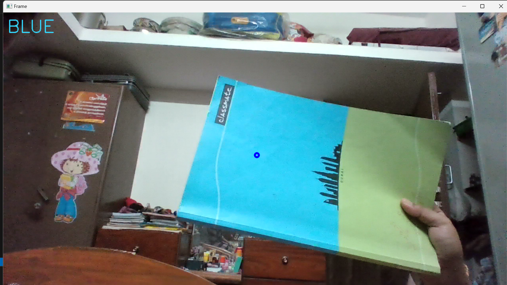
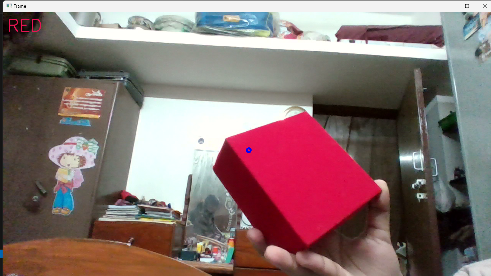

# Live-Video-Color-Detector

This project uses OpenCV to capture video from the webcam and detects the color at the center of the video frame. The detected color is displayed on the video feed in real-time.

# Techstack
Python OpenCV

# How It Works
The script captures video from the webcam and converts each frame to the HSV color space. It then determines the color at the center of the frame based on the hue value and displays the color name on the video feed.

# Screenshots of the OUTPUT



The color Blue is detected.


The color Green is detected.



The color Red is detected. 

## Prerequisites

Ensure you have the following installed:
- Python 3.6+
- OpenCV

You can install OpenCV using pip:
```bash
pip install opencv-python
```
# Running the Project
Clone the repository or download the script:

If you have git installed, you can clone the repository:

bash
Copy code
git clone <repository_url>
cd <repository_directory>
Alternatively, you can simply download the colordetector.py script.

Run the script:

bash
Copy code
python colordetector.py

# Color Ranges
The following HSV hue ranges are used to determine the colors:

RED: 0-4
ORANGE: 5-21
YELLOW: 22-32
GREEN: 33-77
CYAN: 78-89
BLUE: 90-130
VIOLET: 131-159
PINK: 160-169
BLACK: 170-179
